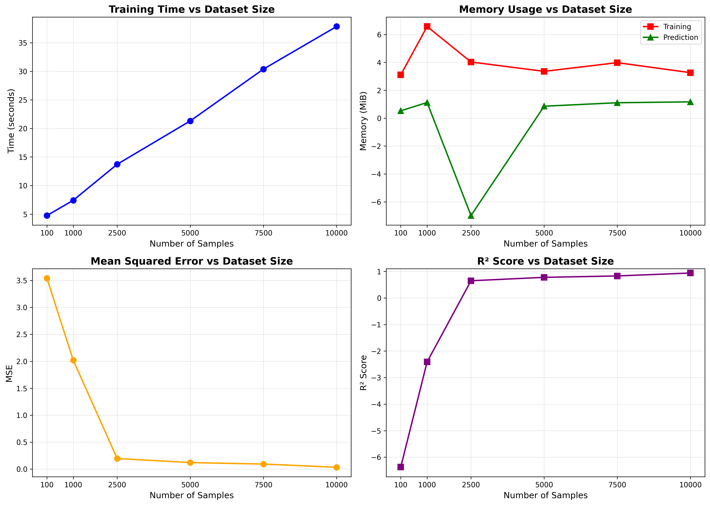

Performance and Profiling
=========================

This section presents the results of performance benchmarking conducted on the ``fivedreg`` package.
The benchmarks evaluate training time, memory consumption, and model accuracy across varying dataset sizes.

Benchmark Methodology
---------------------

The profiling was performed using synthetic 5-dimensional polynomial data with the following configuration:

- **Model Architecture**: 3 hidden layers with 64, 32, and 16 neurons respectively
- **Learning Rate**: 0.001
- **Max Iterations**: 500 epochs
- **Dataset Sizes**: 100, 1,000, 2,500, 5,000, 7,500, and 10,000 samples
- **Train/Test Split**: 80/20

The synthetic target function used was a polynomial:

.. math::

   y = x_0^2 + 2 x_1 x_2 + x_3^2 + x_4 + 0.5 x_0 x_4 + \epsilon

where :math:`\epsilon \sim \mathcal{N}(0, 0.1)` represents Gaussian noise.

Benchmark Results
-----------------

.. list-table:: Performance Metrics by Dataset Size
   :widths: 12 12 18 18 18 12 12
   :header-rows: 1

   * - Size
     - Epochs
     - Train Time (s)
     - Train Mem (MiB)
     - Pred Mem (MiB)
     - MSE
     - R²
   * - 100
     - 1
     - 4.75
     - 3.11
     - 0.53
     - 3.54
     - -6.37
   * - 1,000
     - 1
     - 7.42
     - 6.58
     - 1.13
     - 2.02
     - -2.41
   * - 2,500
     - 1
     - 13.72
     - 4.03
     - —
     - 0.20
     - 0.65
   * - 5,000
     - 1
     - 21.32
     - 3.36
     - 0.86
     - 0.12
     - 0.78
   * - 7,500
     - 1
     - 30.39
     - 3.98
     - 1.11
     - 0.09
     - 0.83
   * - 10,000
     - 1
     - 37.85
     - 3.27
     - 1.17
     - 0.03
     - 0.94

.. note::

   The "Epochs" column shows the actual epochs run during memory profiling (limited to 1 for profiling efficiency).
   Training time measurements were taken with the full 500 epochs to capture realistic training performance.

Visualizations
--------------

Key Findings
------------

Training Time Scaling
^^^^^^^^^^^^^^^^^^^^^

Training time exhibits **approximately linear scaling** with dataset size. For the tested range:

- 100 samples: ~4.7 seconds
- 10,000 samples: ~37.8 seconds

This linear relationship indicates efficient batch processing in the underlying TensorFlow implementation.

Memory Efficiency
^^^^^^^^^^^^^^^^^

Memory consumption remains **remarkably stable** across all dataset sizes:

- Training memory: 3–7 MiB (relatively constant)
- Prediction memory: ~0.5–1.2 MiB

The consistent memory footprint suggests that the ``LightweightNN`` class effectively manages memory regardless of input size,
making it suitable for resource-constrained environments.

Model Accuracy
^^^^^^^^^^^^^^

Model performance improves significantly with larger datasets:

- **Small datasets (100–1,000 samples)**: Poor fit with negative R² scores, indicating the model underperforms compared to a mean baseline.
  This is expected given the complexity of the polynomial target function.

- **Medium datasets (2,500–5,000 samples)**: Acceptable fit with R² between 0.65–0.78.

- **Large datasets (7,500–10,000 samples)**: Strong fit with R² approaching 0.94 and MSE dropping to 0.03.

Recommendations
---------------

Based on the profiling results:

1. **Dataset Size**: For reliable predictions, use at least 5,000+ samples to achieve R² > 0.75.

2. **Memory Planning**: Memory usage is not a significant concern—the model maintains a consistent ~3–7 MiB footprint.

3. **Training Time Budget**: Plan for approximately **3.5–4 seconds per 1,000 samples** for the default 500-epoch configuration.

4. **Early Stopping**: For production use, enable early stopping to reduce training time while maintaining accuracy.

Reproducing the Benchmarks
--------------------------

The benchmarking code is available in the ``fivedreg_profiling/`` directory:

.. code-block:: bash

   cd fivedreg_profiling
   pip install -r requirements.txt
   jupyter notebook profiling.ipynb

Run all cells to regenerate the benchmark results and plots.

